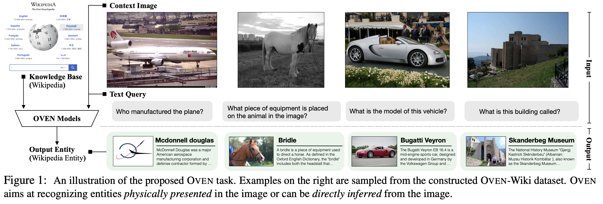

# Dataset Release Page for OVEN

**[Open-domain Visual Entity Recognition: Towards Recognizing Millions of Wikipedia Entities](https://arxiv.org/abs/2302.11154)** (**ICCV 2023 Oral**)

[Hexiang Hu](https://www.hexianghu.com/), [Yi Luan](https://luanyi.github.io/), [Yang Chen](https://edchengg.github.io/), [Urvashi Khandelwal](https://urvashik.github.io/), [Mandar Joshi](https://mandarjoshi90.github.io/), [Kenton Lee](https://kentonl.com/), [Kristina Toutanova](http://kristinatoutanova.com/), [Ming-Wei Chang](https://mingweichang.org/).

[[Project Page]](https://open-vision-language.github.io/oven/) [[Annotation]](#oven-annotation) [[Images]](#oven-images) [[Contributed Code]](https://github.com/edchengg/oven_eval) [[Leaderboard (Coming Soon)]]()

<p align="center">
     <br>
    OVEN models recognize the Visual Entity on the Wikipedia, from images in the wild
</p>

Please use the following bib entry to cite this paper if you are using any resources from the repo.

```
@article{hu2023open,
  title={Open-domain Visual Entity Recognition: Towards Recognizing Millions of Wikipedia Entities},
  author={Hu, Hexiang and Luan, Yi and Chen, Yang and Khandelwal, Urvashi and Joshi, Mandar and Lee, Kenton and Toutanova, Kristina and Chang, Ming-Wei},
  journal={arXiv preprint arXiv:2302.11154},
  year={2023}
}
```


## Introduction

In this project, we formally present the task of Open-domain Visual Entity recognitioN (OVEN), where a model need to link an image onto a Wikipedia entity with respect to a text query. We construct OVEN-Wiki by re-purposing 14 existing datasets with all labels grounded onto one single label space: Wikipedia entities. OVEN challenges models to select among six million possible Wikipedia entities, making it a general visual recognition benchmark with the largest number of labels. 


## OVEN Annotation

The annotations are released as jsaonline file for each set and data split as discussed in the paper. 

Below is an example of the format for a training data:  

```
{
	"data_id": "oven_entity_train_00000000",
	"image_id": "oven_00000000",
	"question": "what is the model of this aircraft?",
	"entity_id": "Q1141409",
	"entity_text": "Dassault Falcon 900",
	"data_split": "entity_train"
}
```

Here entity id are the wikidata id, which is unique and can be searched using the wikidata API: `https://www.wikidata.org/wiki/{entity_id}`. Meanwhile, the entity text are the name of the entity of its corresponding wikidata id, on the 2022/10/01's Wikidump. Note that Wikipedia is constantly updating the entity text name as the name and definition of an entity if changing over the time.


Following are links to each annotation file:

- Entity Set
	- Train Split [Link (962M)](http://storage.googleapis.com/gresearch/open-vision-language/oven/oven_entity_train.jsonl)
	- Val Split [Link (26M)](http://storage.googleapis.com/gresearch/open-vision-language/oven/oven_entity_val.jsonl)
	- Test Split [Link (80M)](http://storage.googleapis.com/gresearch/open-vision-language/oven/oven_entity_test.jsonl)
- Query Set
	- Train Split [Link (6.0M)](http://storage.googleapis.com/gresearch/open-vision-language/oven/oven_query_train.jsonl)
	- Val Split [Link (644K)](http://storage.googleapis.com/gresearch/open-vision-language/oven/oven_query_val.jsonl)
	- Test Split [Link (2.3M)](http://storage.googleapis.com/gresearch/open-vision-language/oven/oven_query_test.jsonl)
- Human Set [Link](http://storage.googleapis.com/gresearch/open-vision-language/oven/oven_human.jsonl)


Meanwhile, to facilitate the reproducibility of experiments, we also release the 6M wikipedia text information (derived from Wikidump 2022/10/01).

- 6 Million Wikipedia Text Information
	- [Full Info (6.9G)](http://storage.googleapis.com/gresearch/open-vision-language/Wiki6M_ver_1_0.jsonl.gz)
	- [Title Only (419M)](http://storage.googleapis.com/gresearch/open-vision-language/Wiki6M_ver_1_0_title_only.jsonl)

To reproduce the dual encoder results using Wikipedia infobox images, you would need to download images from the url in the field `wikipedia_image_url`.

## OVEN Images

See this [guideline](https://github.com/edchengg/oven_eval/tree/main/image_downloads) for image downloading
